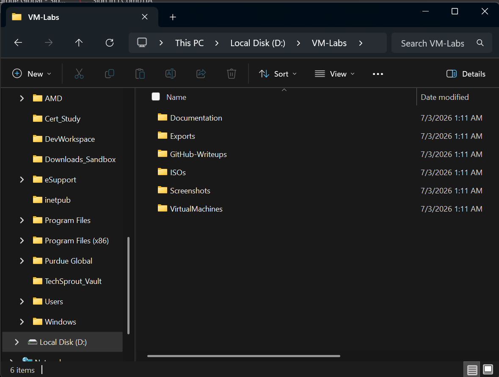
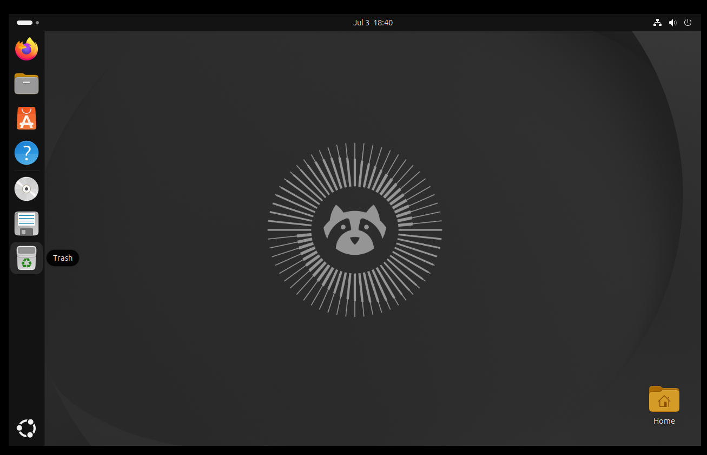
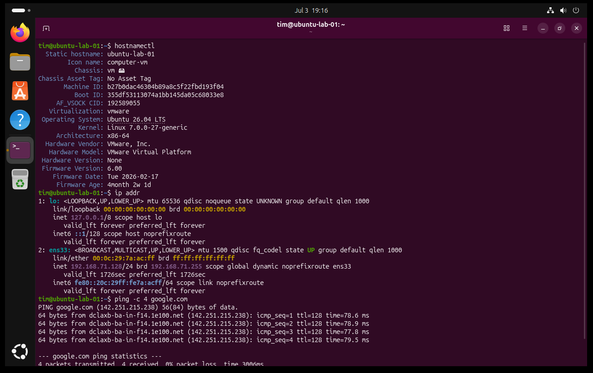
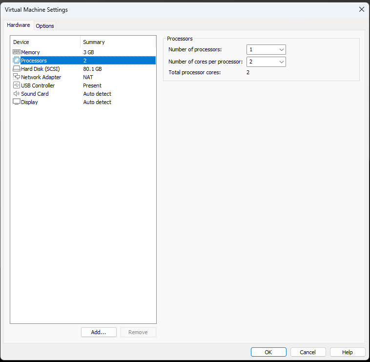
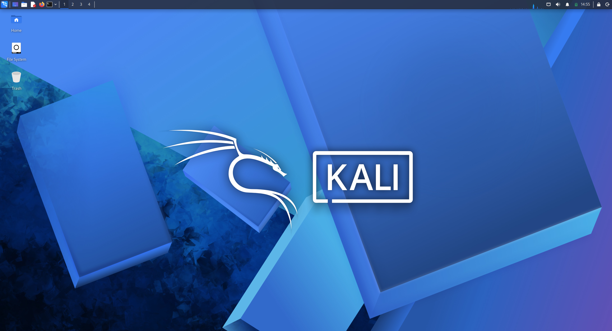
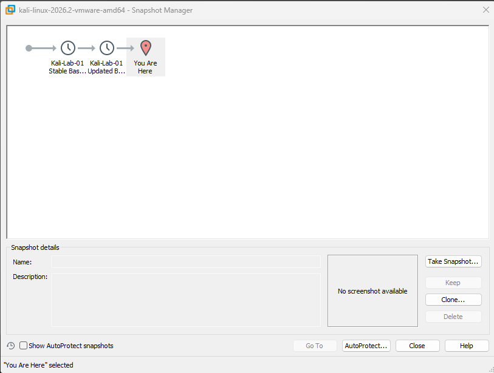
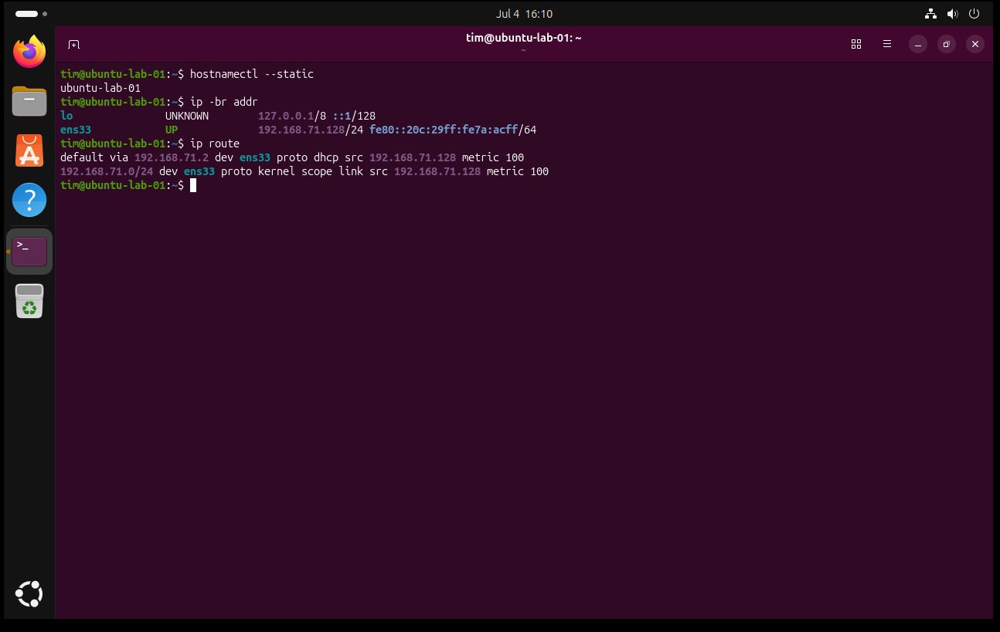
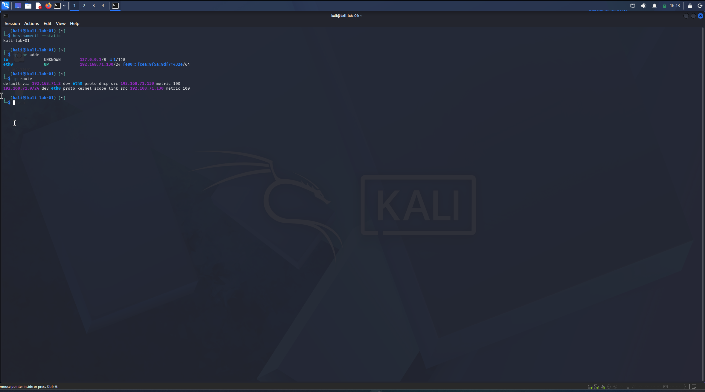
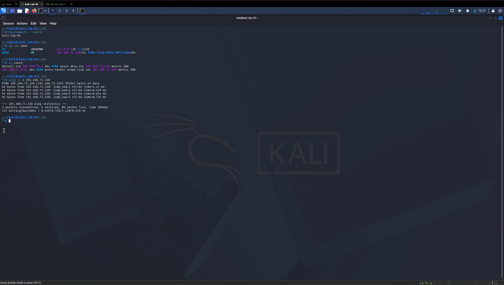
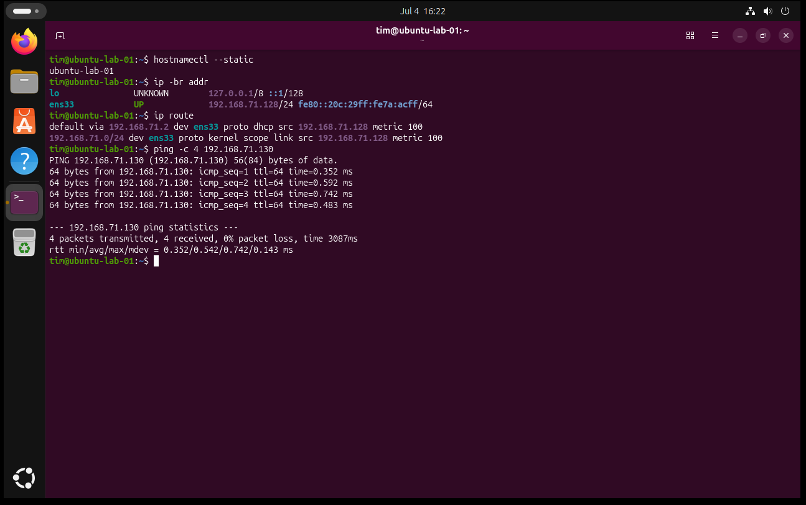

# VMware Linux Networking Lab

## Project Overview

This project documents my first hands-on virtualization and Linux networking lab using VMware Workstation Pro, Ubuntu Desktop, Kali Linux, NAT networking, snapshots, troubleshooting, and Markdown documentation.

The goal of this lab was to build a clean beginner-friendly environment that supports future learning in Linux, networking, IT support, cloud, cybersecurity, and defensive security concepts.

This project is intentionally beginner-level and honest. It does not claim professional cybersecurity experience or offensive security work. It demonstrates foundational technical skills, documentation habits, troubleshooting, and safe lab practices.

---

## Lab Goals

- Install and organize a local virtualization lab on Windows 11 Pro.
- Create a clean folder structure for ISOs, VM files, screenshots, documentation, exports, and GitHub write-ups.
- Install and update an Ubuntu Linux VM.
- Import and stabilize a Kali Linux VM using the official Kali VMware image.
- Confirm both VMs use VMware NAT networking.
- Identify hostnames, network interfaces, IP addresses, and default routes.
- Test basic VM-to-VM connectivity using `ping`.
- Document the process with screenshots and a Markdown lab journal.
- Prepare a sanitized GitHub portfolio project suitable for resume and internship discussions.

---

## Tools and Technologies Used

- Windows 11 Pro host system
- VMware Workstation Pro
- Ubuntu Desktop
- Kali Linux
- VMware NAT networking
- Linux terminal commands
- Markdown documentation
- GitHub

---

## Lab Environment

| Component | Details |
|---|---|
| Host OS | Windows 11 Pro |
| Hypervisor | VMware Workstation Pro |
| Ubuntu VM | Ubuntu-Lab-01 |
| Kali VM | Kali-Lab-01 |
| Ubuntu RAM | 4 GB |
| Kali RAM | 3 GB |
| Ubuntu Network Mode | NAT |
| Kali Network Mode | NAT |
| Ubuntu Interface | ens33 |
| Kali Interface | eth0 |
| Ubuntu IP | 192.168.71.128/24 |
| Kali IP | 192.168.71.130/24 |
| VMware NAT Gateway | 192.168.71.2 |

---

## Folder Organization

The lab was organized under a dedicated VM lab directory on a separate lab drive.

```text
D:\VM-Labs\
D:\VM-Labs\ISOs\
D:\VM-Labs\VM-Images\
D:\VM-Labs\VirtualMachines\
D:\VM-Labs\Screenshots\
D:\VM-Labs\Documentation\
D:\VM-Labs\Exports\
D:\VM-Labs\GitHub-Writeups\
```

Screenshot:



---

## Ubuntu VM Setup

Ubuntu Desktop was installed as the first Linux VM in the lab. After installation, the VM was updated, rebooted, verified, and snapshotted.

Key tasks completed:

- Installed Ubuntu Desktop in VMware Workstation Pro.
- Assigned 4 GB RAM, 2 CPU cores, and a 50 GB virtual disk.
- Configured the VM to use NAT networking.
- Set the hostname to `ubuntu-lab-01`.
- Verified network connectivity.
- Updated the system using `apt`.
- Created VMware snapshots for restore points.

Commands used:

```bash
hostnamectl
lsb_release -a
ip addr
ping -c 4 google.com
sudo apt update
sudo apt upgrade -y
sudo apt autoremove -y
```

Screenshots:





---

## Kali VM Setup

Kali Linux was imported using the official prebuilt VMware image. The VM was configured, stabilized, updated, and snapshotted.

Key tasks completed:

- Downloaded and extracted the official Kali VMware image.
- Opened the Kali `.vmx` file in VMware Workstation Pro.
- Adjusted VM resources for the host laptop.
- Confirmed NAT networking.
- Changed the default Kali password.
- Set the hostname to `kali-lab-01`.
- Updated `/etc/hosts` to prevent hostname resolution warnings.
- Updated Kali using the rolling-release upgrade process.
- Created stable and updated VMware snapshots.

Commands used:

```bash
passwd
sudo hostnamectl set-hostname kali-lab-01
sudo nano /etc/hosts
hostnamectl
ip addr
ping -c 4 google.com
sudo apt update
sudo apt full-upgrade -y
sudo apt autoremove -y
```

Screenshots:







---

## Troubleshooting Highlight

During the Kali setup, the VM booted successfully but the mouse cursor was invisible inside VMware. Mouse input worked, but the pointer could not be seen.

The issue was traced to the Kali VM using an older VMware virtual hardware compatibility level. Updating the VM hardware compatibility from an older Workstation setting to the newest available VMware Workstation compatibility option resolved the issue.

What I learned:

- Prebuilt VM images may use older compatibility settings for broad support.
- A VM can boot successfully while still having display or input integration problems.
- Troubleshooting should be documented before making unnecessary changes.
- A clean baseline snapshot should only be created after the VM is stable.

---

## Basic NAT Networking Test

After both VMs were installed and updated, I confirmed that Ubuntu and Kali were both using VMware NAT networking.

Commands used on both VMs:

```bash
hostnamectl --static
ip -br addr
ip route
```

Ubuntu results:

```text
Hostname: ubuntu-lab-01
Interface: ens33
IP address: 192.168.71.128/24
Default route: default via 192.168.71.2
```

Kali results:

```text
Hostname: kali-lab-01
Interface: eth0
IP address: 192.168.71.130/24
Default route: default via 192.168.71.2
```

Screenshots:





---

## VM-to-VM Connectivity Test

I tested basic connectivity between the two local VMs using `ping`.

Kali to Ubuntu:

```bash
ping -c 4 192.168.71.128
```

Ubuntu to Kali:

```bash
ping -c 4 192.168.71.130
```

Both tests succeeded with 4 packets transmitted, 4 packets received, and 0% packet loss.

Screenshots:





---

## What I Learned

This lab helped me practice and understand:

- How to organize a virtualization lab professionally.
- How VMware NAT networking allows VMs to communicate through a private virtual network.
- The difference between a subnet address, host IP address, and default gateway.
- How to identify Linux hostnames, interfaces, IP addresses, and routes.
- How to test basic connectivity safely using `ping`.
- How to create restore points using VMware snapshots.
- How to troubleshoot VM compatibility issues.
- How to document hands-on technical work for a portfolio.

---

## Safety and Ethics

This lab was limited to my own local virtual machines. No public systems, employer systems, school systems, family devices, or third-party networks were scanned, attacked, or tested.

Kali Linux was used only as a local learning and defensive-awareness tool in a controlled virtual lab environment.

---

## Screenshots Included

| Area | Screenshot |
|---|---|
| Setup | `screenshots/setup/02-vm-labs-folder-structure.png` |
| Ubuntu | `screenshots/ubuntu/04-ubuntu-desktop-running.png` |
| Ubuntu | `screenshots/ubuntu/08-ubuntu-post-update-verification.png` |
| Kali | `screenshots/kali/10-kali-vm-settings.png` |
| Kali | `screenshots/kali/15-kali-cursor-fixed-after-hardware-compatibility.png` |
| Kali | `screenshots/kali/20-kali-updated-baseline-snapshot.png` |
| Networking | `screenshots/networking/21-nat-network-setting-confirmed.png` |
| Networking | `screenshots/networking/22-ubuntu-network-identity-and-route.png` |
| Networking | `screenshots/networking/23-kali-network-identity-and-route.png` |
| Networking | `screenshots/networking/24-kali-ping-to-ubuntu.png` |
| Networking | `screenshots/networking/25-ubuntu-ping-to-kali.png` |

---

## Next Planned Improvements

Future versions of this lab may include:

- Static IP addressing practice.
- SSH connectivity between Linux VMs.
- Basic firewall practice with `ufw`.
- Packet capture practice with Wireshark.
- Optional pfSense lab network segmentation.
- A separate cleaned lab journal in the `docs` folder.
